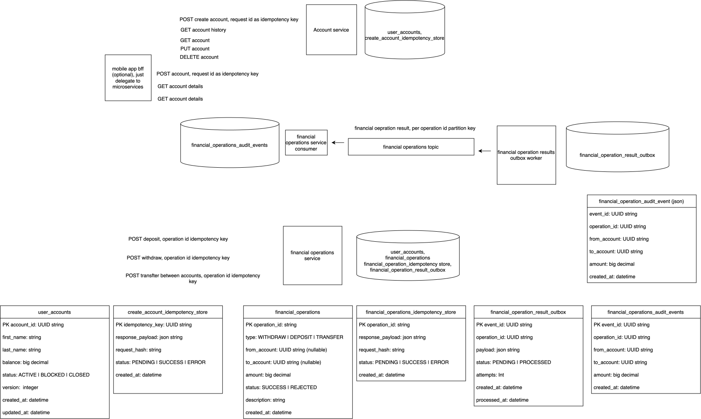

# Recruitment Bank System

Copyright (c) Adam Puchała Software Engineering. For recruitment purposes only.

A Kotlin/Java 25 coroutine-based, non-blocking banking backend with PostgreSQL, Redpanda Kafka, transactional outbox, idempotent requests and an asynchronous audit consumer.

## Prerequisites

- Java 25
- Docker Desktop with Docker Compose
- Postman (optional for the included demonstration collection)

## Build and run

Dockerfiles intentionally contain only the runtime JRE and a prebuilt JAR. Build artifacts first, then start the complete runtime stack:

```bash
./gradlew clean build
docker compose up --build
```

Stop with `docker compose down`. Use `docker compose down -v` only when you intentionally want to remove local database data.

## URLs

- Account API: `http://localhost:8081/api/v1/accounts`
- Account Swagger UI: [http://localhost:8081/swagger-ui.html](http://localhost:8081/swagger-ui.html)
- Account OpenAPI JSON: [http://localhost:8081/v3/api-docs](http://localhost:8081/v3/api-docs)
- Account OpenAPI YAML: [account-service/openapi.yaml](account-service/openapi.yaml)
- Financial API: `http://localhost:8082/api/v1`
- Financial Swagger UI: [http://localhost:8082/swagger-ui.html](http://localhost:8082/swagger-ui.html)
- Financial OpenAPI JSON: [http://localhost:8082/v3/api-docs](http://localhost:8082/v3/api-docs)
- Financial OpenAPI YAML: [financial-operations-service/openapi.yaml](financial-operations-service/openapi.yaml)
- Mobile BFF API: `http://localhost:8080/api/v1/mobile/accounts`
- Mobile BFF Swagger UI: [http://localhost:8080/swagger-ui.html](http://localhost:8080/swagger-ui.html)
- Mobile BFF OpenAPI JSON: [http://localhost:8080/v3/api-docs](http://localhost:8080/v3/api-docs)
- Mobile BFF OpenAPI YAML: [mobile-bff/openapi.yaml](mobile-bff/openapi.yaml)
- Outbox Worker OpenAPI YAML: [outbox-worker/openapi.yaml](outbox-worker/openapi.yaml)
- Audit Consumer OpenAPI YAML: [audit-consumer/openapi.yaml](audit-consumer/openapi.yaml)
- Health: ports `8080`–`8084`, path `/actuator/health`
- PostgreSQL: `localhost:5432`
- Redpanda Kafka: `localhost:19092`

## Architecture

See [ARCHITECTURE.md](ARCHITECTURE.md), [IMPLEMENTATION_PLAN.md](IMPLEMENTATION_PLAN.md), [COROUTINES_MIGRATION_PLAN.md](COROUTINES_MIGRATION_PLAN.md) and the linked Draw.io diagram. The principal consistency boundary is one PostgreSQL transaction containing balance changes, operation history, idempotency state and an outbox event. Kafka audit data is eventually consistent.

### Mobile application

The Kotlin Multiplatform mobile application is maintained in the separate sibling directory [`../mobile-app`](../mobile-app). Open that directory as a separate project in Android Studio to run the Android client; use its `MobileAppScheme` in Xcode for iOS. Start this backend stack first so the app can call the Mobile BFF at port `8080`.

### Mobile BFF

`mobile-bff` is a stateless optional façade for the native client. It delegates account creation and lookup to Account Service, and deposits to Financial Operations Service. It has no database, Liquibase or Kafka ownership. The supported API is intentionally limited to create account, retrieve account details and deposit funds; write requests require `Idempotency-Key` and the BFF forwards it unchanged.

### Architecture diagram



## Trade-offs

The recruitment scope intentionally uses one shared database, no authentication/authorization, no Redis, no CQRS, no separate ledger and no Schema Registry. The outbox worker runs as one replica because the fixed schema has no claim/lease state. JSON event contracts and tests provide compatibility within this exercise.

## Tests

### Automated tests

```bash
./gradlew test
```

Integration verification requires Docker for PostgreSQL/Redpanda Testcontainers and the Compose end-to-end flow.

### Postman end-to-end flow

Start the complete system and wait until the application containers are healthy:

```bash
./gradlew clean build
docker compose up --build
```

In Postman:

1. Import [bank-system.postman_collection.json](postman/bank-system.postman_collection.json).
2. Import [local.postman_environment.json](postman/local.postman_environment.json).
3. Select the `Bank System Local` environment. It configures the Account API at `http://localhost:8081` and the Financial Operations API at `http://localhost:8082`.
4. Open the `Recruitment Bank System` collection and run the complete collection in its defined order. Do not run requests in parallel because later requests use account and operation identifiers saved by earlier test scripts.
5. Confirm that all Postman assertions pass.

The collection executes the following flow:

1. Creates source and destination accounts and stores their identifiers as collection variables.
2. Deposits `1000` into the source account.
3. Repeats the deposit with the same `Idempotency-Key` and verifies that the original operation is returned without applying the balance change again.
4. Transfers `200` from the source account to the destination account.
5. Withdraws `50` from the destination account.
6. Retrieves both accounts and verifies final balances of `800` and `150`.
7. Retrieves account operation history and an individual operation by ID.
8. Attempts an excessive withdrawal and expects `409 INSUFFICIENT_FUNDS`.
9. Blocks the source account and verifies that another deposit is rejected with `409 ACCOUNT_BLOCKED`.
10. Creates and closes a zero-balance account, then verifies that reopening a closed account is rejected.

The collection generates a fresh UUID idempotency key for every new command on each run. Only the deposit and its replay intentionally share `depositIdempotencyKey`, so the idempotency scenario remains explicit while the full collection can be run repeatedly against an existing local database.
